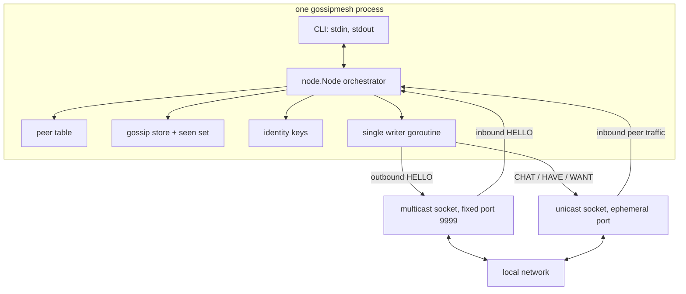

# gossip-mesh

**An encrypted peer-to-peer chat mesh with gossip replication and zero-configuration
LAN discovery — written from scratch in Go, with no networking or protocol
libraries.**

Run it in two terminals on the same Wi-Fi and the nodes find each other with no
configuration: no server, no bootstrap list, no DNS, no account, nothing written
to a database. Messages are signed, encrypted, and replicated between nodes by
gossip, so a message survives the sender leaving.

The scenario it is built for: people who need to talk to each other in a room or
a building where the internet is censored, monitored, or simply switched off, and
where any central server would be both a single point of failure and the first
thing an adversary looks for.

It is also, deliberately, a from-scratch implementation of the subsystems
[libp2p](https://libp2p.io) is built from — peer identity, transport, discovery,
a secure channel, and gossip-based pubsub — at the smallest size that still
works. See [Relationship to libp2p](#relationship-to-libp2p).

## Demo


Four nodes on one machine. Each one announces itself as it starts, every other
node picks it up, and messages reach everybody — the left window runs with
`--verbose`, so the `CHAT` and relay traffic behind each line is visible.

[Full recording](docs/demo.mp4) (110 seconds, ends with `/history` on a node
that joined last).

---

## Quick start

```bash
go build -o gossipmesh ./cmd/gossipmesh

# terminal 1
./gossipmesh --name alice

# terminal 2
./gossipmesh --name bob
```

Type a line and press enter to send it. Commands: `/peers`, `/whoami`,
`/history`, `/help`, `/quit`.

There are no ports or addresses to configure. Discovery happens on a fixed
multicast group, and each node's unicast port is chosen by the OS and advertised
inside its beacon.

### If the nodes never see each other

Multicast is the first thing a firewall or a public/guest network blocks. A node
that is receiving nothing at all tells you so after a few seconds:

```
! no packets received in 6s, so discovery may be blocked here.
!   - a firewall may be dropping inbound UDP to udp/9999 (multicast)
!   - discovery joined Wi-Fi; use --iface to pick another interface
!   - to bypass discovery: run one node with --port 9101, the other with --peer <host>:9101
```

Two ways out. Either allow inbound UDP once (Windows, as administrator):

```powershell
New-NetFirewallRule -DisplayName "gossip-mesh discovery" -Direction Inbound `
  -Protocol UDP -LocalPort 9999 -Action Allow
```

Or skip discovery entirely and point one node straight at the other, which still
involves no server:

```bash
./gossipmesh --name alice --port 9101
./gossipmesh --name bob   --peer 192.168.1.42:9101   # or 127.0.0.1:9101 on one machine
```

### A Windows quirk worth knowing

Several nodes on one Windows machine used to never find each other, and the
firewall took the blame for a while. The real cause was in the standard library:
`net.ListenMulticastUDP` turns `IP_MULTICAST_LOOP` off on the socket it returns.
On Unix that option governs the *sending* path, so switching it off on a
receive-only socket costs nothing. Windows applies it to the *receiving* path,
so the listener silently discarded every multicast packet that originated on the
same machine — no error, no dropped-packet counter, just an empty peer list.

`internal/transport/loopback_windows.go` sets the option back on after the join,
which is why `TestTwoNodesDiscoverViaMulticast` runs instead of skipping there.

### What a working session looks like

Real output from two nodes on one machine, with `--verbose` on the first one so
the protocol is visible:

```
gossipmesh: alice  fingerprint bd2c43b8dcd53498
       identity .gossipmesh/alice.key (created)
       discovery 239.255.42.99:9999 on Wi-Fi (192.168.68.63)
       peer traffic on udp/9111

* bob (bde1a27334f712ae) is online at 127.0.0.1:57851
  · 12:10:59.058 -> HELLO/reply  127.0.0.1:57851 (159 bytes)
[12:11] alice(bd2c43b8dcd53498): hello bob, this is alice
  · 12:11:00.680 -> CHAT         127.0.0.1:57851 (373 bytes)
  · 12:11:06.104 <- CHAT         127.0.0.1:57851 (373 bytes)
[12:11] bob(bde1a27334f712ae): and this is bob replying
1 peer(s):
  bob              bde1a27334f712ae  127.0.0.1:57851  last seen 1s ago
```

`--verbose` shows things that actually happened. The clockwork — a beacon every
2 seconds, a digest every 3 — is hidden unless you ask for `--trace`, which is
worth doing once to watch the protocol tick and unbearable to leave on.

The hex string next to each name is a **fingerprint**: the hash of that peer's
signing key. Names are chosen by their owner and can be duplicated, so the
fingerprint is what actually identifies someone. Two people confirm they are
talking to each other by comparing fingerprints out of band — the same trust
model as an SSH host key.

---

## How to read the code

The code is written to be read from the top down. Each layer only uses the ones
below it.

| Layer | File | What it does |
|---|---|---|
| CLI | [cmd/gossipmesh/main.go](cmd/gossipmesh/main.go) | Flags, terminal in, terminal out. The whole program from outside. |
| Orchestration | [internal/node/node.go](internal/node/node.go) | Owns the sockets and goroutines; one handler per message type. |
| Message security | [internal/crypto/crypto.go](internal/crypto/crypto.go) | Sign, verify, encrypt, decrypt one message. |
| Replication | [internal/gossip/gossip.go](internal/gossip/gossip.go) | What we hold, what we are missing, what to forget. |
| Presence | [internal/discovery/discovery.go](internal/discovery/discovery.go) | The live peer table and its expiry rule. |
| Sockets | [internal/transport/transport.go](internal/transport/transport.go) | Unicast and multicast UDP, interface selection. |
| Wire format | [internal/codec/codec.go](internal/codec/codec.go) | Structs to bytes and back. The parser for hostile input. |
| Keys | [internal/identity/identity.go](internal/identity/identity.go) | The two keypairs, the key file, the fingerprint. |

Start at `main.go`, then read `node.go` — between them they contain the entire
protocol as a sequence of readable steps. Every file explains its own design
decisions in its package comment.



---

## The protocol

Every datagram is one frame:

```
magic[4]="GMSH" | version[1] | type[1] | bodyLength[uint32 BE] | body
```

The magic number matters because Go's multicast listener binds `0.0.0.0` and
therefore receives anything at all sent to that port. The declared length must
match the datagram exactly, so a lying header is rejected at the door.

| Type | Direction | Purpose |
|---|---|---|
| `HELLO` | multicast **and** direct to known peers, every 2s | Presence: name, both public keys, unicast port. Signed. |
| `CHAT` | unicast, relayed | One signed, encrypted message. Forwarded byte-for-byte. |
| `HAVE` | unicast, every 3s | "These are the message ids I hold." |
| `WANT` | unicast, on demand | "Send me these ids." |

A `CHAT` body:

```
id[16] | ts[int64] | senderSignPub[32] | nonce[24]
| recipientCount[1] | { fingerprint[8], wrappedKey[80] } * count
| ciphertextLen[uint16] | ciphertext | signature[64]
```

Bodies are packed binary rather than JSON for two reasons. Size, against a hard
one-datagram budget. And determinism: a signature covers an exact byte sequence,
and JSON has no canonical form, so re-serializing a decoded message could produce
different bytes and break verification.

**Message size.** Everything must fit one datagram, because a fragmented IP
datagram is lost entirely if any fragment drops. The budget is 1400 bytes, and
the limits (8 recipients, 300 bytes of text) come from it: the worst case
measures 1177 bytes, asserted by a test.

**Presence is soft state.** Nobody ever sends a goodbye. A peer exists while its
beacons keep arriving and stops existing 10 seconds (five missed beacons) after
they stop, so a closed laptop, a killed process and someone walking out of range
are all the same event and need no special handling.

That is also why the beacon goes to known peers directly as well as to the
multicast group. A peer reached over unicast would otherwise hear from us exactly
once, when it first discovered us, and then declare us offline after 10 seconds
while we were still there and still receiving its beacons. Refreshing over the
same path we were reached on costs one small packet per peer per interval and
makes presence work even where multicast is blocked or only travels one way.

---

## Encryption and what it does not protect

Each identity has **two** keypairs, and the distinction is the single most
important detail in the crypto:

- **Ed25519** for signing — proves a peer produced exactly these bytes.
- **X25519** for encryption — lets peers encrypt to us, via NaCl `box`.

Both public keys are 32 bytes, which makes them look interchangeable. They are
not: Ed25519 uses the Edwards form of Curve25519 and NaCl `box` uses the
Montgomery form, so passing one where the other belongs produces garbage rather
than an error. Both keys travel in the `HELLO`, which is signed — that signature
is what binds the encryption key to the identity, so nobody can announce their
own encryption key under someone else's name.

Sending a message is hybrid ("lockbox") encryption:

1. Invent a fresh random 32-byte message key.
2. Encrypt the text **once** with it using `secretbox` (16 bytes of overhead).
3. Wrap that key **per recipient** using an anonymous sealed box (80 bytes each).
4. Sign the id, timestamp, sender key, nonce, **recipient list**, and ciphertext.

Encrypting the whole message once per peer would multiply its size by the number
of peers and break the datagram budget; this way the body is paid for once and
each extra recipient costs 80 bytes. Signing the recipient list is what stops a
malicious relay stripping one recipient to silently censor that person.

### Threat model

Protected against:

- **A passive sniffer on the same Wi-Fi.** Content is encrypted; only
  participants can read it.
- **An active injector.** Forged or altered messages fail signature verification
  and are never displayed, stored, or relayed.
- **A malicious relay.** It cannot read, alter, or selectively censor messages,
  and forwarding is byte-for-byte.
- **Replay of captured traffic.** A 5-minute freshness window plus id
  deduplication.
- **Impersonation by name.** Names are cosmetic; identity is the key fingerprint.

Explicitly **not** protected against:

- **No forward secrecy.** Long-term keys wrap every message key, so a stolen key
  file decrypts previously captured traffic. Real forward secrecy needs an
  ephemeral handshake (Noise) or a ratchet (Signal, MLS).
- **Metadata is public.** Who talks, when, how often, and to how many recipients
  is visible to anyone on the network. Only content is hidden.
- **Trust is first-seen.** Nothing prevents an impostor claiming a nickname; the
  defence is comparing fingerprints out of band.
- **No history for late joiners.** Recipients are fixed when a message is sent,
  so a peer who arrives later receives the ciphertext and relays it, but cannot
  read it.
- **Traffic analysis, jamming, and RF-level attacks** are entirely out of scope.

---

## How the mesh converges

**Push.** A valid, new `CHAT` is stored, displayed if readable, and forwarded to
every known peer except the one it came from. Deduplication by message id is what
stops a message circulating forever in a network where everyone forwards to
everyone.

**Pull (anti-entropy).** Push alone is lossy: UDP drops a packet and that message
is simply gone from one node. So every 3 seconds a node advertises the ids it
holds (`HAVE`); a peer missing any of them asks for them (`WANT`) and any holder
answers. This is what makes the mesh converge regardless of which packets were
lost, and what lets a node that was switched off catch up.

Two properties worth noticing:

- **Any holder answers a `WANT`, not just the author.** History therefore
  survives its author leaving, which is what makes this peer-to-peer rather than
  a network of broadcasters.
- **Nodes relay ciphertext they cannot read.** A node that was not a recipient
  still stores and forwards the message, so partly-connected and late-joining
  peers are useful carriers instead of dead ends — and a relay learns nothing
  from what it carries.

All state is bounded: the store keeps the most recent 500 messages, a `HAVE`
digest is capped at 60 ids, and a single `WANT` is answered with at most 16
messages. An append-only store would be a memory leak the moment a hostile peer
started flooding, and an uncapped `WANT` would be a traffic amplifier.

---

## Concurrency

Five goroutines per node, all children of one `context`:

| Goroutine | Blocks on |
|---|---|
| discovery reader | multicast socket |
| peer reader | unicast socket |
| ticker loop | 2s beacon, 3s anti-entropy, 5s peer sweep |
| writer | the send queue — the only code that sends a packet |
| shutdown watcher | context cancellation |

Two decisions here are worth calling out:

**One writer, not a goroutine per send.** Fanning out with `go conn.WriteTo(...)`
gives unbounded goroutines under load and no backpressure. A single writer
draining a bounded channel makes queue depth observable, degrades by dropping
packets rather than exhausting memory, and means one place touches each socket's
write side.

**Shutdown by closing sockets.** Cancelling the context calls `Close`, which
closes the sockets, which makes the blocked reads return `net.ErrClosed`
immediately. That is simpler and more responsive than polling with read
deadlines.

Shared state: the peer table behind a `sync.RWMutex` (read on every send, written
every couple of seconds), and the store plus seen-set behind one `sync.Mutex`
because their updates are compound and must be atomic together — which is exactly
what a `sync.Map` cannot provide.

---

## Tests

```bash
go test ./...
go test -race ./...     # needs a C toolchain; on Windows install gcc or use WSL/CI
```

Unit tests cover the places where a bug would be silent rather than loud:

- **codec** — round-trips, plus every malformed input (bad magic, wrong version,
  lying length, truncation at every offset, trailing bytes, inflated recipient
  count) must error rather than panic. Also that decoding copies its input, since
  the read buffer is reused for the next packet.
- **crypto** — a message readable by both recipients and not a third party; a
  forgery, an altered ciphertext, a stripped recipient and a swapped sender key
  all rejected; a correctly signed but stale message rejected; the worst-case
  datagram size asserted against the budget.
- **gossip** — dedup, capacity eviction, and a two-store `HAVE`/`WANT` exchange
  that converges, which is the anti-entropy algorithm tested without sockets.
- **identity** — keys survive a restart, and a corrupt key file is rejected.
- **node** — two real nodes on real sockets exchanging a real encrypted message,
  once over unicast (`--peer`) and once over multicast. The multicast test skips
  with an explanation when the host blocks multicast, since that is not something
  the program can control.

---

## Relationship to libp2p

libp2p is a stack of swappable modules. This project implements a minimal version
of five of them by hand:

| libp2p subsystem | Here | Difference |
|---|---|---|
| `PeerId` | `identity.Fingerprint` | Truncated SHA-256 of the signing key. Same self-certifying idea. |
| Transport | UDP only | No TCP/QUIC/WebSocket abstraction; `host:port` instead of multiaddrs. |
| mDNS discovery | Multicast beacon | Same mechanism (periodic multicast, TTL expiry), compact signed record instead of DNS wire format. |
| Secure channel (Noise/TLS) | Per-message NaCl envelopes | No handshake, because there are no connections. Costs forward secrecy. |
| GossipSub | `gossip` + `HAVE`/`WANT` | Flood plus anti-entropy; no topics, mesh degree management, or peer scoring. |

Stream multiplexing and NAT traversal have no analogue here: there are no
long-lived connections, and everything is link-local by design.

---

## Not built (and why that is fine)

Internet or multi-hop routing beyond the LAN, NAT traversal, Tor, rooms and
topics, file transfer, on-disk message history, forward-secret ratcheting, a TUI
or web UI, and mobile support.

Two gaps are worth naming precisely because they are the natural next steps:

- **Peer exchange.** Nodes only learn about peers they hear directly. On a
  working multicast LAN everyone hears everyone, so it never comes up; behind a
  firewall, with `--peer`, two nodes seeded to the same third node do not learn
  about each other. A `PEERS` message advertising known peers would fix it.
- **Group key agreement.** Because recipients are fixed at send time, group
  membership is effectively a snapshot per message. A shared group key with
  rekeying on join and leave would give late joiners history and provide forward
  secrecy at the same time.

---

## Flags

| Flag | Default | Purpose |
|---|---|---|
| `--name` | required | Nickname; also the key file name. Letters, digits, `-`, `_`. |
| `--data-dir` | `.gossipmesh` | Where the key file lives. |
| `--port` | `0` (any) | Pin the unicast port; only needed if peers reach you with `--peer`. |
| `--peer` | none | `host:port` of a known peer, for networks that block multicast. |
| `--iface` | auto | Interface for discovery, if the automatic choice is wrong. |
| `--group` | `239.255.42.99` | Multicast group (administratively scoped range). |
| `--discovery-port` | `9999` | Port every node listens on for beacons. |
| `--verbose` | off | Log real events: messages sent, relayed, rejected. |
| `--trace` | off | Also log every beacon and digest. Very chatty. |

Requires Go 1.25 or newer (the floor comes from `golang.org/x/crypto`, which is
the only external dependency).
