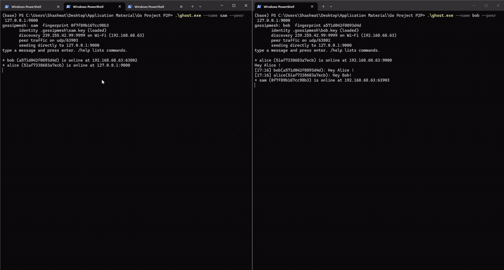

# gossip-mesh

**An encrypted peer-to-peer chat mesh with gossip replication and zero-configuration
LAN discovery — written from scratch in Go, with no networking or protocol
libraries.**

Nodes on the same Wi-Fi find each other with no server, no bootstrap list, no
DNS and no account. Messages are signed, encrypted per recipient, and replicated
by gossip, so a message outlives the sender.



## Quick start

```bash
go build -o gossipmesh ./cmd/gossipmesh

./gossipmesh --name alice     # terminal 1
./gossipmesh --name bob       # terminal 2
```

Type a line to send it. Commands: `/peers`, `/whoami`, `/history`, `/quit`.

Nothing to configure: discovery runs on a fixed multicast group, and each node's
unicast port is chosen by the OS and advertised in its beacon. If a firewall
blocks multicast, the node says so and `--peer host:port` bypasses discovery.

## How it works

**Discovery.** A signed `HELLO` beacon every 2 seconds, to the multicast group
and directly to known peers. Presence is soft state: a peer expires 10 seconds
after its beacons stop, so a closed laptop needs no goodbye message.

**Wire format.** Hand-written binary, one frame per datagram, budgeted at 1400
bytes to stay under the MTU — a fragmented datagram is lost entirely if any
fragment drops. JSON is unusable here because a signature covers exact bytes and
JSON has no canonical form.

```
magic "GMSH"[4] | version[1] | type[1] | bodyLength[uint32] | body
```

| Type | Purpose |
|---|---|
| `HELLO` | Presence: name, both public keys, unicast port. Signed. |
| `CHAT` | One signed, encrypted message. Relayed byte-for-byte. |
| `HAVE` / `WANT` | Anti-entropy: ids I hold, ids I need. |

**Crypto.** Two keypairs per identity: Ed25519 to sign, X25519 to encrypt. A
message is sealed once with a random key (`secretbox`), and that key is wrapped
per recipient in an 80-byte sealed box — so eight recipients cost eight small
keys, not eight copies of the message. The signature covers the recipient list,
so a relay cannot strip someone out to censor them. Identity is the fingerprint
(truncated SHA-256 of the signing key); names are cosmetic.

**Replication.** New messages are flooded to every known peer and deduplicated
by id. Because UDP drops packets, every 3 seconds a node advertises what it
holds (`HAVE`) and any peer missing something asks for it (`WANT`) — answered by
any holder, not just the author, which is why history survives its author
leaving. Nodes relay ciphertext they cannot read. All state is bounded: 500
messages, 60 ids per digest, 16 messages per reply.

**Concurrency.** Five goroutines per node under one `context`: two socket
readers, a ticker, a single writer draining a bounded queue, and a shutdown
watcher. One writer means backpressure is observable and overload drops packets
instead of spawning goroutines. Cancelling the context closes the sockets, which
unblocks every read at once.

## Code map

Written to be read top-down; each layer uses only the ones below it.

| Layer | File |
|---|---|
| CLI | [cmd/gossipmesh/main.go](cmd/gossipmesh/main.go) |
| Orchestration: sockets, goroutines, handlers | [internal/node/node.go](internal/node/node.go) |
| Sign, verify, encrypt, decrypt | [internal/crypto/crypto.go](internal/crypto/crypto.go) |
| Store, dedup, anti-entropy | [internal/gossip/gossip.go](internal/gossip/gossip.go) |
| Peer table and expiry | [internal/discovery/discovery.go](internal/discovery/discovery.go) |
| UDP sockets, interface selection | [internal/transport/transport.go](internal/transport/transport.go) |
| Wire format, hostile-input parser | [internal/codec/codec.go](internal/codec/codec.go) |
| Keys, key file, fingerprint | [internal/identity/identity.go](internal/identity/identity.go) |

Every file explains its own design decisions in its package comment.

## Relationship to libp2p

libp2p is a stack of swappable modules. This implements a minimal version of
five of them by hand, rather than importing `go-libp2p`.

| libp2p subsystem | Here | Difference |
|---|---|---|
| `PeerId` | `identity.Fingerprint` | Truncated SHA-256 of the signing key. Same self-certifying idea. |
| Transport | UDP only | No TCP/QUIC abstraction; `host:port` instead of multiaddrs. |
| mDNS discovery | Multicast beacon | Same mechanism, compact signed record instead of DNS wire format. |
| Secure channel | Per-message NaCl envelopes | No handshake, because there are no connections. Costs forward secrecy. |
| GossipSub | Flood + `HAVE`/`WANT` | No topics, mesh degree management, or peer scoring. |

## Not protected against

Metadata is public — who talks, when and to how many is visible; only content is
hidden. There is no forward secrecy, since long-term keys wrap every message
key. Trust is first-seen, so comparing fingerprints out of band is the defence
against impersonation. And recipients are fixed at send time, so a peer who
joins later relays messages it cannot read.

## Tests

```bash
go test ./...
go test -race ./...     # needs a C toolchain
```

Malformed-input coverage for the parser (bad magic, lying lengths, truncation at
every offset, inflated counts), forgery and replay rejection for the crypto, a
socket-free anti-entropy convergence test for gossip, and two real nodes
exchanging an encrypted message over live sockets.

## Flags

| Flag | Default | Purpose |
|---|---|---|
| `--name` | required | Nickname; also the key file name. |
| `--peer` | none | `host:port` of a known peer, where multicast is blocked. |
| `--port` | any | Pin the unicast port, if peers reach you with `--peer`. |
| `--data-dir` | `.gossipmesh` | Where the key file lives. |
| `--iface` | auto | Interface for discovery, if the guess is wrong. |
| `--group` | `239.255.42.99` | Multicast group. |
| `--discovery-port` | `9999` | Port every node listens on for beacons. |
| `--verbose` / `--trace` | off | Real events / every beacon and digest. |

Requires Go 1.25+. `golang.org/x/crypto` is the only dependency.
